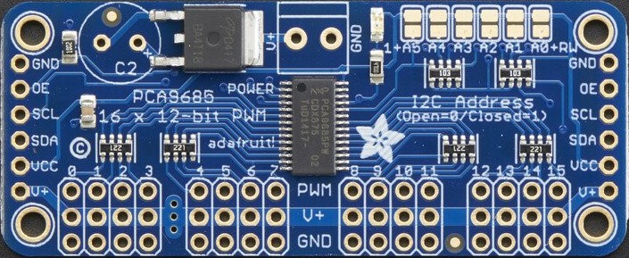

# An 18 DOF Hexapod project using Arduino Uno + PCA9685

# Hardware
* Body: 3D printed, go to [STL](STL) folder 
* [Arduino Uno](https://store.arduino.cc/arduino-uno-rev3) 
* [Adafruit 16-channel PWM driver (PCA9685)](https://www.adafruit.com/product/815) 
* SG-90 mini servo x 18 
* DC/DC Buck Voltage regulator (Mini 360 from Taobao/[Amazon](http://www.amazon.com/4-75-23V-1-17V-DC-DC-Converter-Module/dp/B00NJCAI7G)) 
* 7.4V battery 
# Electronics

# How to use

# Software

# Libraries

