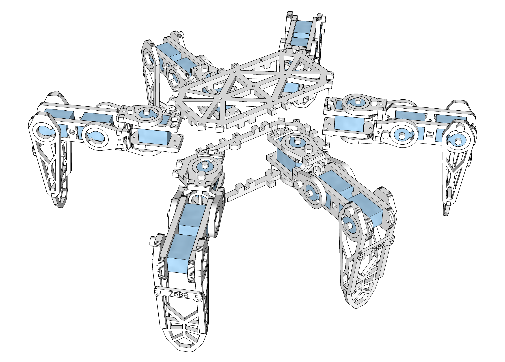

# An 18 DOF Hexapod project using Arduino Uno + PCA9685

# Hardware
* Body: 3D printed, go to [STL](STL) folder 

  
  
* [Arduino Uno](https://store.arduino.cc/arduino-uno-rev3) 

  
  
* [Adafruit 16-channel PWM driver (PCA9685)](https://www.adafruit.com/product/815) 

  
  
* SG-90 mini servo x 18 ![image]

  
  
* DC/DC Buck Voltage regulator (Mini 360 from Taobao/[Amazon](http://www.amazon.com/4-75-23V-1-17V-DC-DC-Converter-Module/dp/B00NJCAI7G)) 

  
  
* 7.4V battery 

  
  
# Electronics

# How to use

# Software

# Libraries

|* Body: 3D printed, go to [STL](STL) folder ||
|---|---|
|* [Arduino Uno](https://store.arduino.cc/arduino-uno-rev3) ||
|* [Adafruit 16-channel PWM driver (PCA9685)](https://www.adafruit.com/product/815)  | |
|* SG-90 mini servo x 18 ![image] |  |
|* DC/DC Buck Voltage regulator (Mini 360 from Taobao/[Amazon](http://www.amazon.com/4-75-23V-1-17V-DC-DC-Converter-Module/dp/B00NJCAI7G))  |   |
|* 7.4V battery  |  |
